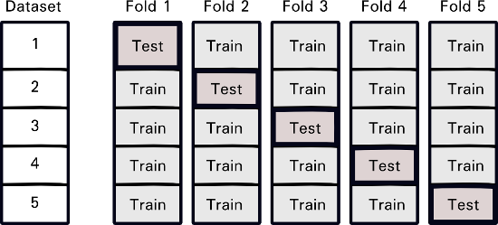
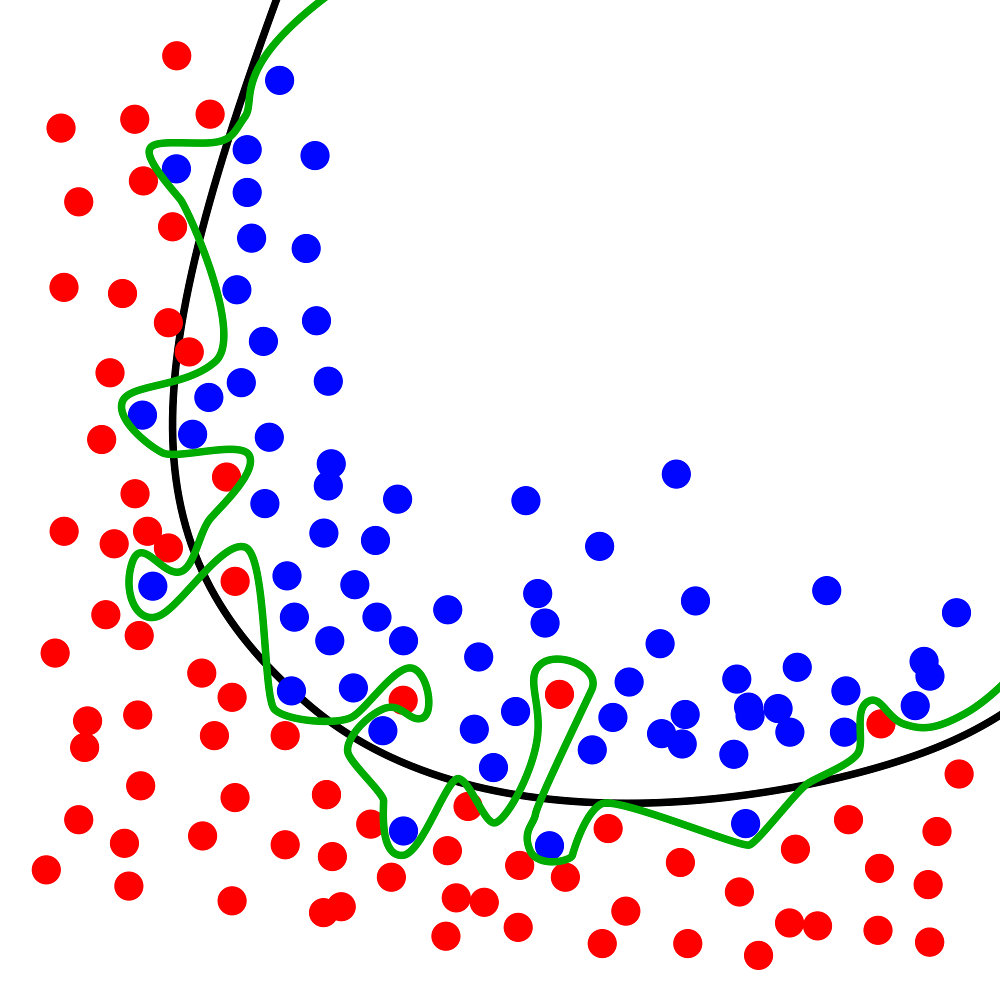

# Applying Machine Learning Algorithms

For more information on machine learning, see the previous tutorial at [this page](https://aldro61.github.io/microbiome-summer-school-2017/).

## Experimental Protocol

Here we begin the machine learning analysis.

We first need to design the experiment so that we have reproductible and unbiaised results.
As seen in previous tutorials in this summer school, we need to ensure that we keep some data separate in order to ensure we have good, generalizable results.

This is done by randomly splitting the dataset into a **training set** and a **test set**.
The algorithms will be trained on the training set, but the test set is kept separate to check whether an algorithm performs well on new, or never seen before, data.


For this machine learning section, much of the code has already been released in [scikit-learn](http://scikit-learn.org/stable/).
We will use many of their functionalities for the rest of this tutorial.

The following function and code will automatically split a dataset into randomly selected training sets and test sets.

```python
from sklearn.model_selection import train_test_split

X_train, X_test, Y_train, Y_test = train_test_split(data, tags, test_size=0.25, random_state=42)
```

## Cross-validation

Now that the dataset is split, we must consider the learner and how we will  determine its optimal parameters.
We cannot train the algorithm on the training set with each different algorithm and then see the best parameters on the testing set, as this way the test set would be repeatedly used and any benefit from keeping a testing set will be lost!

In order to test the parameters, we can use a method called **cross-validation**.
As shown by the figure below, we split the training set into multiple *folds*.
Each fold will serve as a test set once, while all the other folds serve as a training set.
This way, we can test the hyper-parameters of the algorithm on the data of the training set and still see how it behaves on never-seen-before data.



An implementation of cross-validation algorithms are already implemented in the package scikit-learn.
We can thus simply create a learner that will cross-validate itself on the training data simply.

For this tutorial, we will create a Decision Tree classifier, as presented during the plenary sessions.
The following code will create the Decision Tree learner and a cross-validator.

```python
from sklearn.model_selection import GridSearchCV
from sklearn.tree import DecisionTreeClassifier

param_grid = {
    "max_depth":[1,2,3,4,5,6]
}
learner = GridSearchCV(DecisionTreeClassifier(random_state=42),
                      param_grid=param_grid,
                      cv=5)
```

We can now train the learner easily by using the *fit* function with the training data and the tags of the training data.

```python
learner.fit(X_train, Y_train)
```

## Assessing the accuracy

Now that the algorithm has been applied to the training set, we must evaluate how well it learned and how good its predictions are.
We want to avoid an effect called **overfitting**, as shown on the figure below.
This effect is when the algorithm performs very well on the training set but its prediction do not generalize to a testing set.
This effect is why we split the dataset into training and testing set, in order to confirm if this happens, and why we use cross-validation, to find parameters that do not overfit.



Our first step when we want to evaluate the learner is that we need its predictions on the training set and testing sets.
The following commands, using the *predict* function, returns the predictions of the learner on the data it is given.

```python
predictions_on_train = learner.predict(X_train)

predictions_on_test = learner.predict(X_test)
```
We then need to define some metrics by which to compare the true tags and the predicted ones from the algorithm.

In this case, we will use the *zero one loss*, which is the error rate of the algorithm.
This loss is 0 when the predicted label is the same as the true one, and 1 otherwise.
We can then substract the zero one loss from 1 and obtain the accuracy, or the percentage of good predictions.

The other function we will use is the scikit-learn classification report.
This function calculated three metrics: [the recall, the precision](https://en.wikipedia.org/wiki/Precision_and_recall) and the [F1 score](https://en.wikipedia.org/wiki/F1_score).
The precision is the number of true positives divided by the amount of elements predicted as positive. (True Positives/(True Positives + False Positives)).
The recall score is the number of true positives divided by the amount of positive elements (True Positives/(True Positives + False Negatives)).
The F1 score is a weighted average of the precision and recall.
These scores are equally important, as the accuracy can be good in some cases while having a majority of false positives on negatives on one class or the other.

The following commands will calculate those metrics on the predictions and print them.

```python
from sklearn.metrics import classification_report, zero_one_loss

#Results on the Training Set
print(classification_report(Y_train, predictions_on_train))
print(1. - zero_one_loss(Y_train, predictions_on_train))

#Results on the Testing Set
print(classification_report(Y_test, predictions_on_test))
print(1. - zero_one_loss(Y_test, predictions_on_test))
```

We can then compare the metrics on both the training and testing sets.

Has the learner overfitted?
Are the results good on the test set?

## On your own!

This marks the end of the tutorial. 
If you wish to experiment further, feel free to edit the ipython notebook provided in this tutorial and try to change the parameters of the different algorithms (correction, alignment, machine learning).
You could even try out different learning algorithms covered during the summer school.
In the ipython notebook, the code is provided for an AdaBoost classifier.

